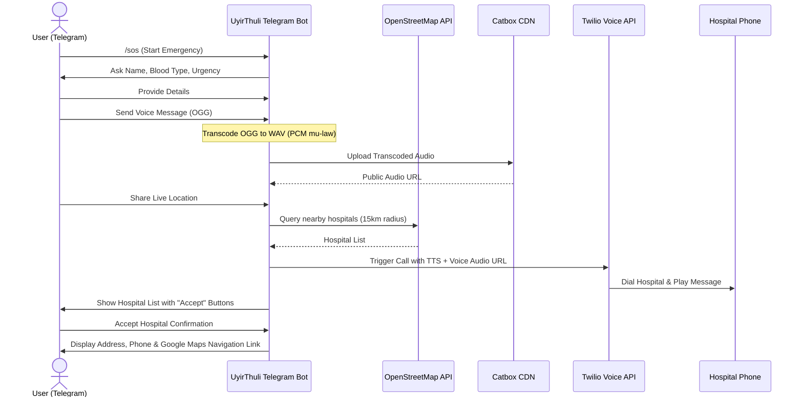

# UyirThuli (BloodRadar SOS) 🩸

**UyirThuli** (meaning *Life Drop* in Tamil) is an emergency blood dispatch and locating assistant built as a Telegram bot. In critical situations where blood is needed urgently, UyirThuli helps users request blood, records their situations via voice, identifies nearby hospitals using real-time geolocation query, and automates emergency notifications to hospital administrators.

---

## 🌟 Key Features

- **Conversational SOS Flow:** Simple guided conversation (`/sos` command) to collect patient name, required blood group, and level of urgency.
- **Voice Message Integration:** Captures patients' voice explanations, automatically transcodes them to Twilio-compatible telephony format (`pcm_mulaw` WAV), and hosts them securely to play back during automated voice calls.
- **Location-Based Hospital Discovery:** Queries the **OpenStreetMap (OSM) Overpass API** dynamically to locate nearby hospitals within a 15km radius of the user's live Telegram location.
- **Automated Emergency Calls:** Integrates with the **Twilio Voice API** to initiate automated phone calls to hospitals, playing a synthetic message alongside the patient's actual recorded voice message.
- **Interactive Confirms & Routing:** Generates custom in-chat interactive buttons for hospitals. Once a hospital confirms availability, the user can accept, instantly receiving detailed contact info, address details, and a direct Google Maps routing link.
- **Demo Fallback Mechanism:** Includes built-in simulated data for testing and hackathon demonstrations if OpenStreetMap querying fails or if coordinates are outside covered regions.

---

## 🏗️ Architecture & Workflow



---

## 🛠️ Technology Stack

- **Core Logic:** Python 3.10+
- **Telegram Interface:** `python-telegram-bot` (v21.1.1+)
- **Audio Processing:** `imageio-ffmpeg` & `audioop-lts` (for handling raw PCM audio formats and subprocess ffmpeg wraps)
- **External APIs:**
  - **OpenStreetMap Overpass API:** For spatial querying of nearby healthcare amenities.
  - **Catbox CDN API:** Public audio hosting for Twilio playback compatibility.
  - **Twilio Voice API:** For dispatching custom voice calls to physical telephones.

---

## ⚙️ Configuration & Environment Variables

Copy the `.env.example` file to `.env`:
```bash
cp .env.example .env
```

Open `.env` and configure the following variables:

| Variable Name | Description | Example |
| :--- | :--- | :--- |
| `TELEGRAM_BOT_TOKEN` | Bot API token generated from Telegram's `@BotFather` | `123456789:ABCdefGhI...` |
| `TWILIO_ACCOUNT_SID` | Your Twilio Account SID | `ACXXXXXXXXXXXXXXXXXXXXXXXXXXXXXXXX` |
| `TWILIO_AUTH_TOKEN` | Your Twilio Authentication Token | `your_auth_token` |
| `TWILIO_PHONE_NUMBER` | Your Twilio purchased phone number | `+1234567890` |
| `MY_PHONE_NUMBER` | Target number for demo calls (used in verification sandbox) | `+919876543210` |

---

## 🚀 Setup & Execution

### 1. Prerequisites
Make sure Python 3.10+ and `pip` are installed on your machine.

### 2. Install Dependencies
Install all required libraries specified in `requirements.txt`:
```bash
pip install -r requirements.txt
```

### 3. Run the Bot
Start the polling application:
```bash
python main.py
```

Open Telegram, search for your bot, and send `/sos` to begin the emergency blood request workflow.

---

## 🧪 Testing Integration

A standalone test script `test_osm.py` is included to verify the connection and queries to the OpenStreetMap Overpass API:
```bash
python test_osm.py
```
This script queries for hospitals in Chennai, India, and outputs the status and payload structure to ensure network and API functionality.
