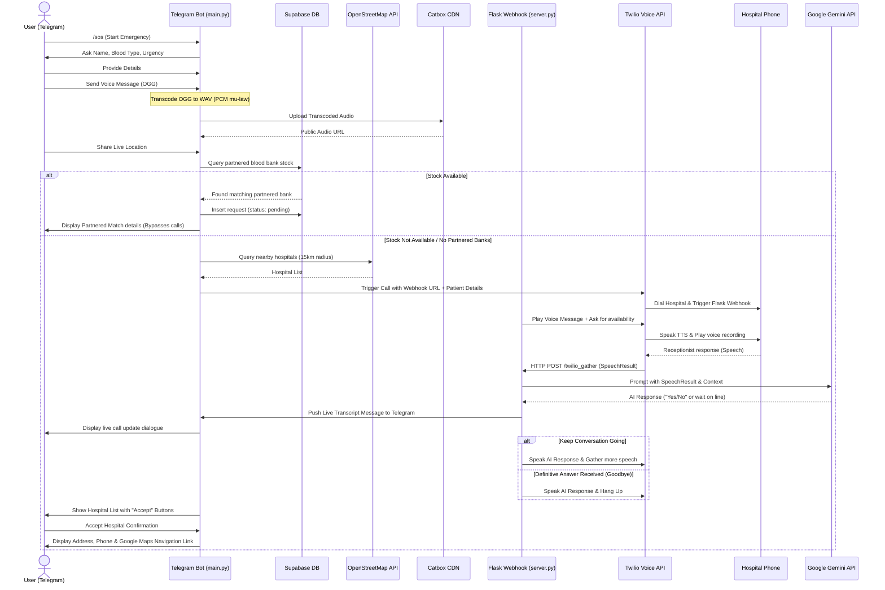

# UyirThuli (BloodRadar SOS) 🩸

**UyirThuli** (meaning *Life Drop* in Tamil) is an emergency blood dispatch and locating assistant built as a Telegram bot. In critical situations where blood is needed urgently, UyirThuli helps users request blood, records their situations via voice, identifies nearby hospitals using real-time geolocation query, and automates emergency notifications to hospital administrators.

It integrates **Twilio Voice API** with **Google Gemini** to initiate automated phone calls to hospitals, playing a synthetic message alongside the patient's actual recorded voice message, followed by a live conversational AI interaction to verify blood inventory.

---

## 🌟 Key Features

- **Conversational SOS Flow:** Simple guided conversation (`/sos` command) to collect patient name, required blood group, and level of urgency.
- **Partnered Blood Bank Match (Supabase):** Instantly checks a Supabase database of partnered blood banks for matching stock. If stock is available, it bypasses phone calls, sends the request to their dashboard, and coordinates the match immediately.
- **Location-Based Hospital Discovery:** Queries the **OpenStreetMap (OSM) Overpass API** dynamically to locate nearby hospitals within a 15km radius of the user's live Telegram location.
- **Automated Emergency Calls & AI Agent:** Integrates with the **Twilio Voice API** to call hospitals. If `WEBHOOK_URL` is configured, it launches a live Flask webhook server (`server.py`) powered by **Google Gemini** (`gemini-3.1-flash-lite`).
- **Interactive Conversational AI on Calls:** Gemini holds a natural conversation with the hospital receptionist, checking for blood availability. It handles holds ("please wait while I check") and says "Goodbye" when it receives a final YES/NO response.
- **Live Call Transcripts in Chat:** Stream-reports the live call dialog (what the receptionist said and what the AI replied) back to the user's Telegram chat in real time.
- **Voice Message Integration:** Captures patients' voice explanations, automatically transcodes them to Twilio-compatible telephony format (`pcm_mulaw` WAV), and hosts them securely to play back during automated voice calls.
- **Interactive Confirms & Routing:** Generates custom in-chat interactive buttons for hospitals. Once a hospital confirms availability, the user can accept, instantly receiving detailed contact info, address details, and a direct Google Maps routing link.
- **Demo Fallback Mechanism:** Includes built-in simulated data for testing and hackathon demonstrations if OpenStreetMap querying fails or if coordinates are outside covered regions.

---

## 🏗️ Architecture & Workflow



---

## 🛠️ Technology Stack

- **Core Logic:** Python 3.10+
- **Telegram Interface:** `python-telegram-bot` (v21.1.1+)
- **Audio Processing:** `imageio-ffmpeg` & `audioop-lts` (for transcoding audio metadata and wrapping subprocess ffmpeg)
- **Database / Platform API:** `supabase-py` (for querying partnered stock and logging incoming requests)
- **Conversational Webhook Server:** `Flask` (for hosting Twilio Webhook endpoints)
- **Generative AI Core:** `google-generativeai` (utilizing `gemini-3.1-flash-lite` for live phone dialogue)
- **External APIs:**
  - **OpenStreetMap Overpass API:** For spatial querying of nearby healthcare amenities.
  - **Catbox CDN API:** Public audio hosting for Twilio playback compatibility.
  - **Twilio Voice API:** For dispatching custom voice calls and capturing speech input.

---

## 💾 Database Schema (Supabase)

If you are using the partnered blood bank matching system, your Supabase project must contain the following schema:

### 1. `blood_banks` Table
Stores location, name, and contact details of partnered blood banks.
```sql
create table blood_banks (
  id bigint generated always as identity primary key,
  name text not null,
  location text,
  phone text,
  lat double precision,
  lng double precision,
  created_at timestamp with time zone default timezone('utc'::text, now()) not null
);
```

### 2. `stock` Table
Stores live blood stock counts mapped to blood banks.
```sql
create table stock (
  id bigint generated always as identity primary key,
  blood_bank_id bigint references blood_banks(id) on delete cascade,
  a_pos integer default 0,
  a_neg integer default 0,
  b_pos integer default 0,
  b_neg integer default 0,
  ab_pos integer default 0,
  ab_neg integer default 0,
  o_pos integer default 0,
  o_neg integer default 0,
  updated_at timestamp with time zone default timezone('utc'::text, now()) not null
);
```

### 3. `requests` Table
Logs requests pushed to the live portal/dashboard of the blood banks.
```sql
create table requests (
  id bigint generated always as identity primary key,
  blood_bank_id bigint references blood_banks(id) on delete cascade,
  name text not null,
  blood_type text not null,
  distance_km real,
  status text default 'pending', -- pending, accepted, rejected
  created_at timestamp with time zone default timezone('utc'::text, now()) not null
);
```

---

## ⚙️ Configuration & Environment Variables

Copy the `.env.example` file to `.env`:
```bash
cp .env.example .env
```

Configure the following variables:

| Variable Name | Description | Example / Note |
| :--- | :--- | :--- |
| `TELEGRAM_BOT_TOKEN` | Bot API token generated from Telegram's `@BotFather` | `123456789:ABCdefGhI...` |
| `TWILIO_ACCOUNT_SID` | Your Twilio Account SID | `ACXXXXXXXXXXXXXXXXXXXXXXXXXXXXXXXX` |
| `TWILIO_AUTH_TOKEN` | Your Twilio Authentication Token | `your_auth_token` |
| `TWILIO_PHONE_NUMBER` | Your Twilio purchased phone number | `+1234567890` |
| `MY_PHONE_NUMBER` | Target number for demo calls (Twilio verified sandbox number) | `+919876543210` |
| `WEBHOOK_URL` | Exposed public URL pointing to your local Flask app | `https://xxxx-xx-xxx.ngrok-free.app` |
| `GEMINI_API_KEY` | Your Google Gemini API Key | `AIzaSy...` |
| `SUPABASE_URL` | (Optional) Your Supabase project URL | `https://xxxx.supabase.co` |
| `SUPABASE_KEY` | (Optional) Your Supabase Anon/Service-Role Key | `eyJhbGci...` |

---

## 🚀 Setup & Execution

### 1. Prerequisites
Make sure Python 3.10+ and `pip` are installed on your machine. For live Twilio calls, you will also need [ngrok](https://ngrok.com/) to tunnel traffic to your local server.

### 2. Install Dependencies
Install all required libraries specified in `requirements.txt`:
```bash
pip install -r requirements.txt
```

### 3. Run the Conversational Webhook Server
Start the Flask application. By default, it runs on port `5000`:
```bash
python server.py
```

### 4. Expose the Server via ngrok
In a separate terminal, expose your local Flask server to the internet so Twilio can post to it:
```bash
ngrok http 5000
```
Copy the HTTPS URL generated by ngrok (e.g., `https://xxxx-xx-xxx.ngrok-free.app`) and paste it as the `WEBHOOK_URL` in your `.env` file.

### 5. Run the Bot
Start the Telegram polling application:
```bash
python main.py
```

Open Telegram, search for your bot, and send `/sos` to begin the emergency blood request workflow.

---

## 🧪 Testing Integration

A standalone test script `test_osm.py` is included to verify connection and queries to the OpenStreetMap Overpass API:
```bash
python test_osm.py
```
This script queries for hospitals in Chennai, India, and outputs the status and payload structure to ensure network and API functionality.
